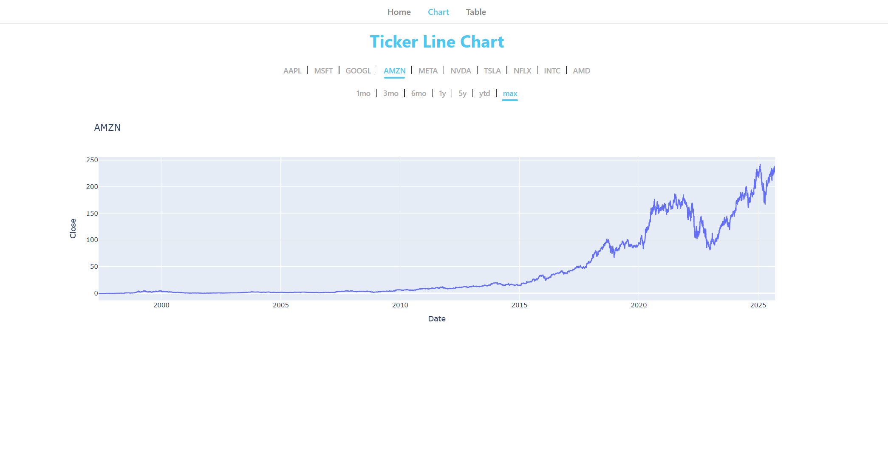
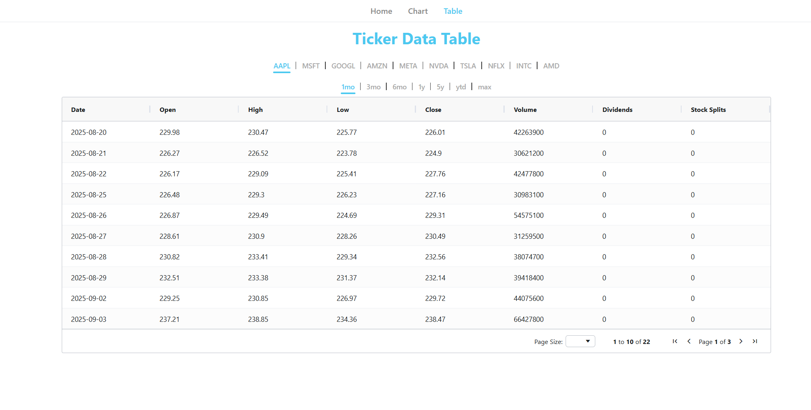

# Plotly Yahoo Finance — Stock Price Dashboard

Interactive Dash app that fetches historical stock data from Yahoo Finance and visualizes it with Plotly.

## Key features
- Interactive stock charts (time series, range selection)
- Data table view with paging and sorting
- Simple server-side caching to reduce repeated API calls
- Multi-page Dash app (Home, Chart, Table)

## Chart page


## Table page


## Dependencies
- Python 3.8+
- dash
- plotly
- yfinance
- pandas
- dash-ag-grid
- Flask-Caching (used via `cache_config.py`)

## Quick start (Windows PowerShell)

1. Create and activate a virtual environment

```powershell
python -m venv .venv
.\.venv\Scripts\Activate
```

2. Install dependencies

```powershell
pip install -r requirements.txt
```

3. Run the app

```powershell
python app.py
```

By default the Dash server runs on http://127.0.0.1:8050

## Project layout
- `app.py` - main Dash application, registers pages and caching
- `cache_config.py` - cache initialization and configuration
- `utils.py` - helper functions used across pages (data fetching/formatting)
- `pages/` - Dash page modules
	- `home_page.py` - landing page and instructions
	- `chart_page.py` - ticker chart UI and callbacks
	- `table_page.py` - table view using dash-ag-grid
- `assets/` - static files (CSS and screenshots)

> [!NOTE]
> The app uses `yfinance` for data. Be mindful of rate limits when making many requests.  
> Caching is enabled via `Flask-Caching` (`SimpleCache` by default).
